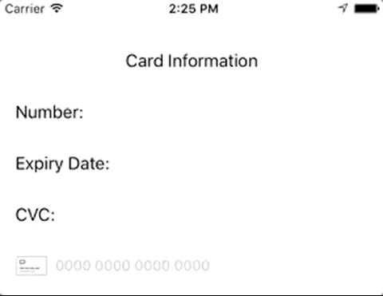

# ThinCreditCard

[](https://travis-ci.org/tsarikovskiy/ThinCreditCard)
[](http://cocoapods.org/pods/ThinCreditCard)
[](http://cocoapods.org/pods/ThinCreditCard)
[](http://cocoapods.org/pods/ThinCreditCard)

## Example


To run the example project, clone the repo, and run `pod install` from the Example directory first.

## Requirements

## Installation

ThinCreditCard is available through [CocoaPods](http://cocoapods.org). To install
it, simply add the following line to your Podfile:

```ruby
pod 'ThinCreditCard'
```

## Author

tsarikovskiy, s.tsarikovskiy@nullgr.com

## License

ThinCreditCard is available under the MIT license. See the LICENSE file for more info.
